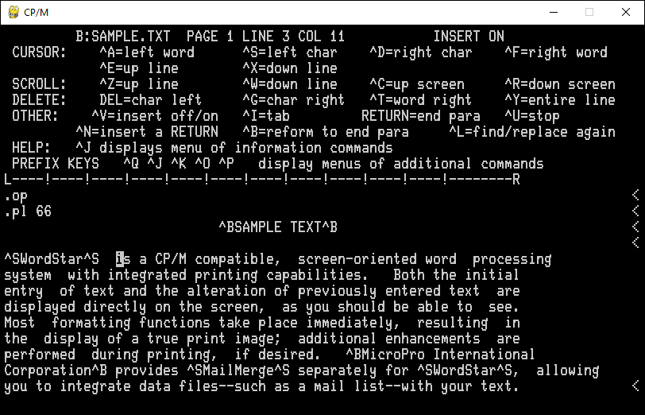

# 8080 Emulator in Python

An Intel 8080 emulator written in Python. It runs Altair BASIC and CP/M! It
even passes 8080EXER!

## Screenshots

Wordstar on CP/M on my 8080 emulator on Python on Windows:


Hunt the Wumpus on Altair 8K BASIC on my 8080 emulator on Python on Windows:


Passing 8080 instruction exerciser tests:


## Running Altair BASIC

To run Altair BASIC, just run `altair_basic.py`:

```
python altair_basic.py
```

It will load 8K BASIC by default. Use the `-4`, `-8`, and `-e` options to
specify 4K, 8K, or Extended BASIC.

You can specify a program to load on start with `-f`:

```
python altair_basic.py -8 -f wumpus.bas
```

## Running CP/M

To run CP/M, first install [PyGame][1] and [Bitstring][2]:

```
pip install -U pygame bitstring
```

[1]: https://www.pygame.org/
[2]: https://bitstring.readthedocs.io/

Then, run `cpm.py`, specifying the disk images to load using the `-da`, `-db`,
`-dc`, ..., `-dp` options. You'll probably want to set `-da` to
`cpm_2.2/cpm22py64k.bin` unless you've created your own bootable disk images.

```
python cpm.py -da cpm_2.2/cpm22py64k.bin -db wordstar.bin
```

The image file must be raw images of single-sided single-density 8-inch floppy
disks with CP/M 2.2 directory data, such as an image created using
[cpmtools][3]' default format, `ibm-3740`.

[3]: http://www.moria.de/~michael/cpmtools/

## 8080 instruction exerciser

To run 8080EX1 without CP/M, run `8080exer.py`:

```
python 8080exer.py
```

## Resources

- [Altair BASIC programs](https://deramp.com/downloads/altair/software/basic_programs/)
  on deramp.com
- [CP/M 2.2 manual](http://www.cpm.z80.de/manuals/archive/cpm22htm/index.htm)
- [Dave's Old Computers - Disk/Software Image Archive](http://dunfield.classiccmp.org/img/index.htm)
- [Retrocomputing Archive - Commercial CP/M Software](http://www.retroarchive.org/cpm/index.html)
